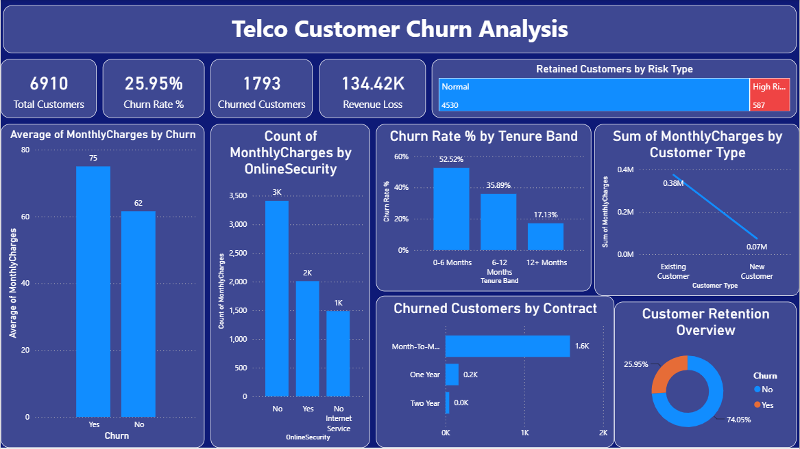
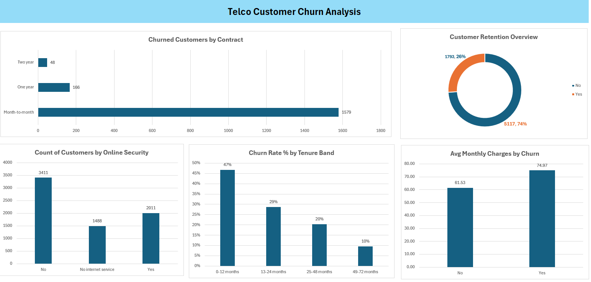

# Telco Customer Churn Analysis

A beginner-level data analytics project made as practice. It uses **Python, SQL Server, Excel and Power BI** to find out why telecom customers leave (churn) and which customers are most at risk.

> This is a learning project. I built it while following a YouTube tutorial and used the same dataset, then did the cleaning, analysis and dashboards myself in each tool.

---

## Dashboard Preview

**Power BI Dashboard**



**Excel Dashboard**



---

## Key Numbers

| Measure | Value |
|---|---|
| Total customers (after cleaning) | 6,910 |
| Churned customers | 1,793 |
| Churn rate | 25.95% |
| Monthly revenue lost due to churn | 134,423.60 (about 134.42K) |
| Average monthly charges (churned) | 74.97 |
| Average monthly charges (retained) | 61.53 |

---

## Tools Used

| Tool | What I used it for |
|---|---|
| Python (Pandas, Matplotlib) | Data cleaning and simple charts |
| SQL Server (SSMS) | 10 queries to analyse churn |
| Excel | Pivot tables, charts and a dashboard |
| Power BI | Final interactive dashboard |

---

## Project Steps

1. **Python:** cleaned the raw data and made 7 charts.
2. **SQL Server:** loaded the clean data into a table and ran 10 queries.
3. **Excel:** built 5 pivot tables and a dashboard.
4. **Power BI:** built the final dashboard with KPI cards and charts.

---

## Data Cleaning (Python)

The raw file has 7,048 rows and 21 columns. The cleaning steps were:

- Removed the `$` sign from `MonthlyCharges` and `TotalCharges` and changed them to numbers.
- Removed rows with missing values and duplicate rows (7,048 rows became 6,910).
- Changed `SeniorCitizen` from 0/1 to No/Yes.
- Fixed the contract name `month to month` to `Month-to-month`.
- Added a `ChurnFlag` column (Yes = 1, No = 0).
- Added a `TenureGroup` column (0-12, 13-24, 25-48 and 49-72 months).

The final cleaned file has 6,910 rows and 23 columns.

---

## Main Findings

- **Contract type:** Month-to-month customers churn the most (42.07%). One year is 11.28% and two year is only 2.85%.
- **Tenure:** New customers leave more. Churn is 46.81% in the first 12 months and drops to 9.51% after 49 months.
- **Internet service:** Fiber optic customers churn at 41.11%, compared to 18.45% for DSL.
- **Payment method:** Electronic check users churn the most (44.43%). Automatic payments are around 15% to 17%.
- **Senior citizens:** Churn is 40.66% for senior citizens and 23.10% for others.
- **Extra services:** Customers without Online Security churn at 40.93%, while customers with it churn at 14.62%.
- **Monthly charges:** Customers who left pay more on average (74.97) than customers who stayed (61.53).
- **Gender:** Almost the same for both (26.47% female and 25.43% male), so it is not an important factor.

---

## Simple Suggestions

- Offer discounts or benefits to move month-to-month customers to one or two year plans.
- Give extra attention to customers in their first year.
- Promote Online Security and Tech Support to customers who do not have them.
- Encourage customers to switch from electronic check to automatic payment.

---

## Folder Structure

```
Telco Customer Churn Analysis/
|-- data/
|   |-- telco_churn_unclean.csv
|   |-- telco_churn_cleaned_python.csv
|-- python/
|   |-- Telco_Churn_Python_Analysis.ipynb
|-- sql/
|   |-- Telco_Churn_Analysis.sql
|   |-- (query result screenshots)
|-- excel/
|   |-- telco_churn_cleaned_python.xlsx
|   |-- excel_dashboard.png
|-- powerbi/
|   |-- Customer_Churn_Analysis.pbix
|   |-- powerbi_dashboard.png
|-- images/
|   |-- (Python chart images)
|-- README.md
```

---

## Note

The Power BI dashboard uses 3 tenure bands (0-6, 6-12 and 12+ months), while Python, SQL and Excel use 4 tenure groups (0-12, 13-24, 25-48 and 49-72 months). Both show the same result: new customers churn the most.

---

## Author

**Santosh Chaurasia**
M.Sc. Data Science student, University of Mumbai
Email: amsantoshchaurasia@gmail.com
